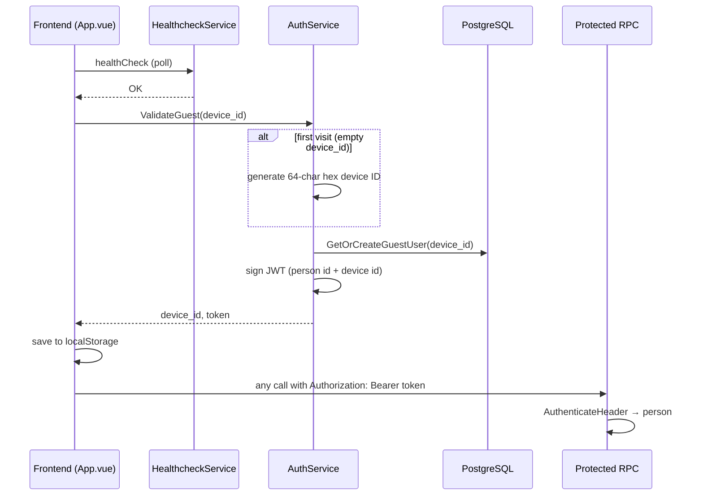

# Guest auth

uses **guest-only** authentication. There is no sign-up, login form, or Telegram OAuth yet — each browser gets a stable **device ID**, the backend creates or looks up a guest **person**, and returns a **JWT** the frontend stores and sends on later RPCs.

Registered accounts and other auth methods (e.g. Telegram) are planned in the proto stubs but not implemented.

## End-to-end flow



**When the backend is offline:** the app still loads. Guest session creation is skipped until `HealthcheckService` reports OK. Cached token/device ID in `localStorage` are kept but not refreshed.

## API (`auth.v1.AuthService`)

Proto: [`proto/auth/v1/auth.proto`](../proto/auth/v1/auth.proto)

| RPC | Auth required | Description |
|-----|---------------|-------------|
| `ValidateGuest` | No | Resolve or create guest by `device_id`; return JWT |

### `ValidateGuest`

**Request**

- `device_id` — client’s existing ID from `localStorage`, or `""` on first visit.

**Response**

- `device_id` — same as sent, or a newly generated 64-character hex string.
- `token` — HS256 JWT for the guest person.

**Server behavior**

1. If `device_id` is empty, generate a cryptographically random device ID.
2. Look up `person_auth_methods` where `auth_type = guest_device` and `auth_value = device_id`.
3. If missing, insert a new `persons` row (`is_guest = true`, random 8-char username/display name) and link the auth method.
4. Sign a JWT with subject = person ID, custom claims `igu` (is guest) and `did` (device ID).

JWT lifetime: **365 days** (`GuestJWTExpiryDuration` in [`backend/api/auth.go`](../backend/api/auth.go)). Re-calling `ValidateGuest` with the same device ID returns a **new token** for the **same person** (idempotent identity, fresh expiry).

## Protecting RPCs (backend)

Handlers that need a caller call `AuthenticateHeader` on the Connect request headers:

```go
person := app.AuthenticateHeader(ctx, req.Header())
if person == nil {
    return nil, connect.NewError(connect.CodeUnauthenticated, ErrCantAuthenticateUser)
}
```

Implementation: [`backend/api/auth_middleware.go`](../backend/api/auth_middleware.go)

- Expects `Authorization: Bearer <jwt>`.
- Parses and validates JWT with `JWT_SECRET` (env `JWT_SECRET`).
- Loads `persons` row by token subject (person ID).

**Services that require auth today**

| Service | RPCs |
|---------|------|
| `account.v1.AccountService` | `GetMe`, `GetPerson` |
| `room.v1.RoomService` | all |

`AuthService` and `HealthcheckService` do **not** require a token.

## Database

Migration: [`backend/db/migrations/20260102000000_create_person.sql`](../backend/db/migrations/20260102000000_create_person.sql)

Queries: [`backend/db/query/persons.sql`](../backend/db/query/persons.sql)

### `persons`

| Column | Guest usage |
|--------|-------------|
| `id` | JWT subject |
| `username` / `display_name` | Random 8-char string on create (same value) |
| `is_guest` | `true` for device guests |
| `coins` | Default 100 |

### `person_auth_methods`

| Column | Guest usage |
|--------|-------------|
| `auth_type` | `guest_device` |
| `auth_value` | Device ID string |
| `user_id` | FK to `persons.id` |

Unique on `(auth_type, auth_value)` — one person per device ID.

## Frontend

### Bootstrap

[`frontend/src/App.vue`](../frontend/src/App.vue) calls `useGuestAuth()` once at startup. That composable is shared module state (not per-component).

### Session lifecycle — `useGuestAuth`

File: [`frontend/src/composables/use-guest-auth.ts`](../frontend/src/composables/use-guest-auth.ts)

1. Read `device_id` and `token` from `localStorage` (if present).
2. Watch `useBackendHealth().isBackendHealthy`.
3. When the API becomes healthy, call `AuthService/ValidateGuest` once (deduped if already in flight).
4. Persist returned `device_id` and `token`; expose reactive `deviceId`, `token`, `isGuest`.

Errors during validate are swallowed — the site remains usable without a session.

### Storage — `guest-auth-storage`

File: [`frontend/src/libs/guest-auth-storage.ts`](../frontend/src/libs/guest-auth-storage.ts)

| Key | Purpose |
|-----|---------|
| `chigame_device_id` | Stable device identifier |
| `chigame_guest_token` | JWT |

If `localStorage` is unavailable, the session lives in memory for the current tab only.

### Attaching the token

[`frontend/src/libs/api-client.ts`](../frontend/src/libs/api-client.ts) registers a Connect interceptor that reads `chigame_guest_token` and sets `Authorization: Bearer …` on **every** RPC. No manual header wiring in views.

### Profile — `useGuestProfile`

File: [`frontend/src/composables/use-guest-profile.ts`](../frontend/src/composables/use-guest-profile.ts)

After a guest token exists and the backend is healthy, fetches `AccountService/GetMe` via TanStack Query (`queryKey: ['account', 'me']`). Exposes `username`, `displayUsername` (e.g. `@abc12xyz`), and `isLoading`.

Used on the home page for the guest’s display name. Invite room UI uses `isGuest` from `useGuestAuth` to gate create/join actions.

## Code map

### Backend

| Path | Role |
|------|------|
| [`backend/api/auth_rpc.go`](../backend/api/auth_rpc.go) | `ValidateGuest` handler |
| [`backend/api/auth.go`](../backend/api/auth.go) | Guest user CRUD, JWT create/validate |
| [`backend/api/auth_middleware.go`](../backend/api/auth_middleware.go) | `AuthenticateHeader` |
| [`backend/api/account_rpc.go`](../backend/api/account_rpc.go) | `GetMe` / `GetPerson` |
| [`backend/api/auth_test.go`](../backend/api/auth_test.go) | JWT and guest user tests |

Regenerate RPC stubs: `buf generate` from repo root.

### Frontend

| Path | Role |
|------|------|
| [`frontend/src/composables/use-guest-auth.ts`](../frontend/src/composables/use-guest-auth.ts) | Session bootstrap and shared state |
| [`frontend/src/composables/use-guest-profile.ts`](../frontend/src/composables/use-guest-profile.ts) | `GetMe` for UI |
| [`frontend/src/libs/guest-auth-storage.ts`](../frontend/src/libs/guest-auth-storage.ts) | `localStorage` helpers |
| [`frontend/src/libs/api-client.ts`](../frontend/src/libs/api-client.ts) | Bearer interceptor |
| [`frontend/src/composables/use-backend-health.ts`](../frontend/src/composables/use-backend-health.ts) | Gates guest session until API is up |

## Configuration

| Env | Used by |
|-----|---------|
| `JWT_SECRET` | Backend — signs and verifies guest JWTs |

Must be set in production; tests use a fixed dev secret via helpers in `auth_test.go`.

## Adding behavior later

1. **New auth method** (e.g. Telegram) — extend `auth.proto`, implement a new RPC, insert `person_auth_methods` with a new `auth_type`, optionally set `is_guest = false`.
2. **Account merge** — `persons.merged_at` exists for linking a guest to a registered user; not wired yet.
3. **Token refresh** — call `ValidateGuest` again with the same `device_id` (frontend already does this on each healthy backend transition); optional dedicated refresh RPC if you need rotation without re-identifying the device.
4. **Protected RPC** — call `AuthenticateHeader` in the handler; return `CodeUnauthenticated` when nil.

Related: rooms depend on guest auth — see [`docs/room.md`](room.md).
